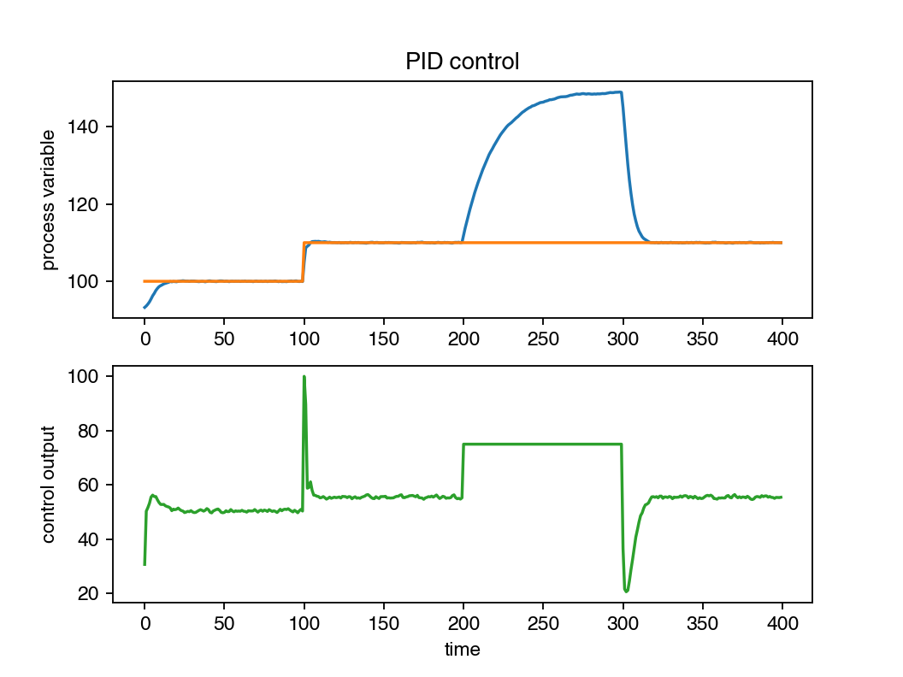

# Tiny PID
Minimal PID controller in Python. 

Optional features: 
- Output limiting
- Anti-windup mechanism
- Lowpass filtering of derivative component
- Bumpless transfer between manual and automatic control
- Gain scheduling
- Feed forward component

## Future ideas
- Output dithering
- No output change if we are near the setpoint, for, e.g. reducing motor noise
- Beyond gain scheduling also schedule, limits, and anti-windup
- Output rate limiting
